# AI Cyber Human Shield

AI Cyber Human Shield is a Chrome MV3 browser extension demo for hackathon judges. It detects phishing risks in Gmail and Outlook Web, explains every flag with evidence, keeps human decision authority, and logs every analysis/decision locally.

## Why This Is Hackathon-Ready

- Fully local, privacy-first processing (no backend, no external API calls)
- Real extraction from live Gmail/Outlook DOM
- 8 explainable detectors with confidence and evidence
- Human-in-the-loop buttons (Block, Trust, Ignore)
- Offline demo mode with six curated test emails
- Full audit trail in local storage plus CSV export

## Folder Structure

```text
.
├── manifest.json
├── src
│   ├── background
│   │   ├── background.js
│   │   └── detector-orchestrator.js
│   ├── content
│   │   └── contentScript.js
│   └── popup
│       ├── popup.html
│       ├── popup.css
│       └── popup.js
├── test-emails
│   ├── samples.json
│   └── demo.html
└── docs
    └── README.md
```

## Installation

1. Download or clone this folder.
2. Open Chrome and go to chrome://extensions.
3. Enable Developer mode.
4. Click Load unpacked and select the project root folder.
5. Pin the extension to your toolbar.

### Icon Note

This demo uses inline SVG data URI icons in manifest.json so no PNG generation is required.

## Usage Guide

### Gmail / Outlook Live

1. Open an email in Gmail or Outlook Web.
2. Click the extension icon.
3. The popup extracts sender, subject, body, links, attachments.
4. Analysis runs locally and returns score + explainable findings.
5. Choose a human decision: Block Sender, Trust Sender, or Ignore.
6. Open View Decision History for audit logs and CSV export.

### Standalone Demo (No Live Inbox Needed)

1. Navigate to: chrome-extension://<your_extension_id>/test-emails/demo.html
2. Pick any of the six scenarios.
3. Click Test This Email.
4. Show judges threat score, level color, and WHY explanation blocks.

## Architecture Overview

```mermaid
flowchart LR
    A[User opens email] --> B[contentScript.js]
    B --> C[Extract sender/subject/body/links/attachments]
    C --> D[background.js]
    D --> E[DetectorOrchestrator]
    E --> F[8 detectors + confidence]
    F --> G[Weighted threat score]
    G --> H[WHY explanations with evidence]
    H --> I[popup.js UI render]
    I --> J[Human decision buttons]
    J --> K[chrome.storage.local threat_log]
```



## Component Responsibilities

- manifest.json: Chrome MV3 config, host permissions, scripts, popup, icons.
- src/content/contentScript.js: Detects provider and extracts email data from DOM.
- src/background/background.js: Message router for analyze/get_logs/log_decision + log persistence.
- src/background/detector-orchestrator.js: Feature extraction, detector execution, scoring, explanation engine.
- src/popup/popup.html: Structured UI states (initial/loading/main/error/log).
- src/popup/popup.css: Professional responsive design, gauge, badges, cards.
- src/popup/popup.js: Data orchestration, risk rendering, toggles, decision logging, CSV export.
- test-emails/samples.json: Six judge-friendly test cases.
- test-emails/demo.html: Click-to-test standalone extension demo page.

## Detector Explanations (8)

1. malicious_link
- Checks URL shorteners, high entropy links, IP-host URLs, text-destination mismatch.

2. suspicious_domain
- Checks typosquatting similarity, suspicious TLDs, generated domain patterns.

3. phishing_text
- Flags language like verify, reset, suspend, locked, security alert.

4. urgency
- Flags pressure phrases like act now, immediately, final notice, last chance.

5. social_engineering
- Detects brand/authority impersonation and sender-brand mismatch.

6. bad_ip
- Flags blacklisted (mock offline list) and private IP occurrences.

7. toxic_content
- Detects abusive/hate-oriented coercive language.

8. financial_scam
- Flags wire transfer, bank details, crypto/payment instruction language.

## WHY Engine

Every detected risk returns:

- detected: boolean
- confidence: 0-100
- indicators[] where each indicator has:
  - type
  - reason
  - explanation
  - confidence
  - evidence[]

Popup risk cards expose these details through expandable WHY sections so judges can see traceable reasoning.

## Threat Scoring Algorithm

Weighted sum using detector confidence:

- malicious_link: 25
- suspicious_domain: 20
- phishing_text: 20
- urgency: 10
- social_engineering: 10
- bad_ip: 7
- toxic_content: 5
- financial_scam: 3

Score formula per detector:

weighted contribution = weight * (confidence / 100) when detected

Final score = round(sum of contributions), capped at 100.

Thresholds:

- 0-24: Low
- 25-49: Medium
- 50-74: High
- 75-100: Critical

## Demo Flow For Judges

1. Start with clean Amazon email -> low score baseline.
2. Show PayPal shortener + urgency sample -> high score.
3. Show advanced bank sample (.tk + IP URL + attachment) -> critical score.
4. Expand WHY cards to show reason, explanation, evidence, confidence.
5. Click Block/Trust/Ignore to prove human validation workflow.
6. Open Decision History and export CSV to show auditability.
7. Open Gmail/Outlook real inbox email to prove live extraction works.

## Troubleshooting

- If popup shows extraction error:
  - Open an actual email thread first, then retry.
- If demo.html cannot message extension:
  - Ensure URL starts with chrome-extension://<id>/test-emails/demo.html.
- If logs are empty:
  - Trigger at least one analysis in popup or demo page.
- If score seems low/high:
  - Expand risk cards to inspect detector confidence and evidence.

## Privacy and Performance

- All processing happens locally in browser.
- No remote requests for analysis.
- Designed for sub-2s analysis in normal email sizes.
- Log retention capped at latest 100 entries.

## Dependencies

No external npm packages required for MVP demo.

- Platform APIs: chrome.runtime, chrome.tabs, chrome.storage.local
- Browser APIs: DOM, URL, Blob, fetch

## Hackathon Differentiation

Why this project wins:

- Explainability-first instead of opaque scoring
- Human decision controls reduce false-positive harm
- Works fully offline for dependable on-stage demo
- Immediate compatibility with Gmail + Outlook Web
- End-to-end audit history for trust, governance, and post-incident review
